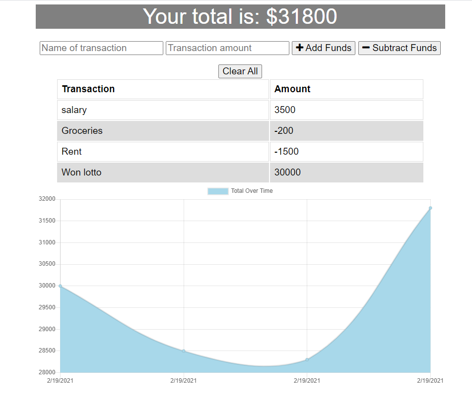

# Progressive Web Application - Budget Tracker

## About the Project
This Budget Tracker is an application that allows a user to add expenses and deposits to their budget with or without a connection. When entering transactions offline, their inputs will populate the total when brought back online.

This project used the following technologies: **Node, MongoDB, Mongoose, Express, and Morgan and IndexDB.**

## Installation
Simply clone the repository and run `npm install ` in your terminal.

This will create the node modules folder you will need in order for this application to function correctly.

## Usage
In order to get this application to run you must open up the terminal and enter the following:

`node server.js`
The application will then console log the url in the terminal that you will need to access the application.

Server listening on: http://localhost:8080 then enter this into a browser of your choice.

### Screenshots

## URL
The project can be live hosted on heroku here: https://agile-reaches-08871.herokuapp.com/

## Author
Author: Rachael McIlhagga  
Twitter: @mcilhaggis
To view my other repositories or to connect with me on GitHub please click Here If you have any questions please feel free to reach out to me at the following email: rachael.mcilhagga@live.co.uk 

## License
This source code is available to all and the project is licensed under the MIT License - see the LICENSE.md file for details

## Badges

